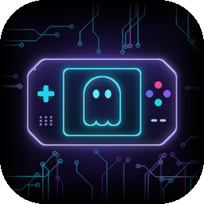
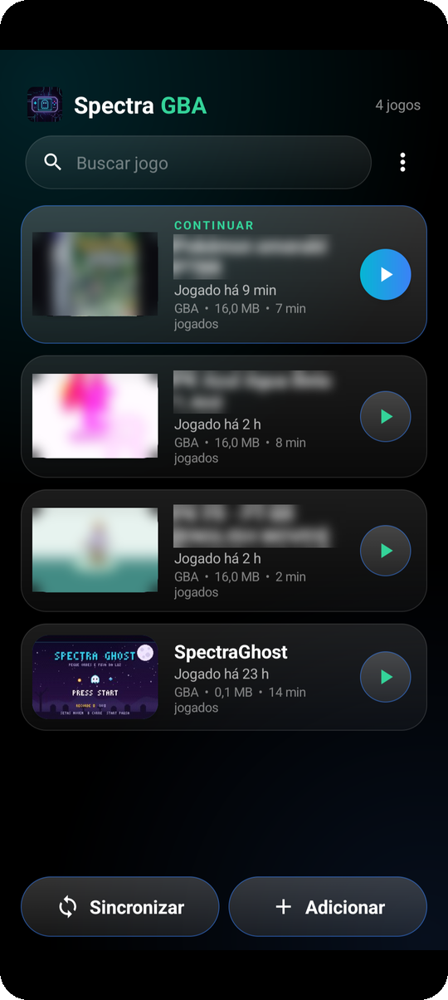
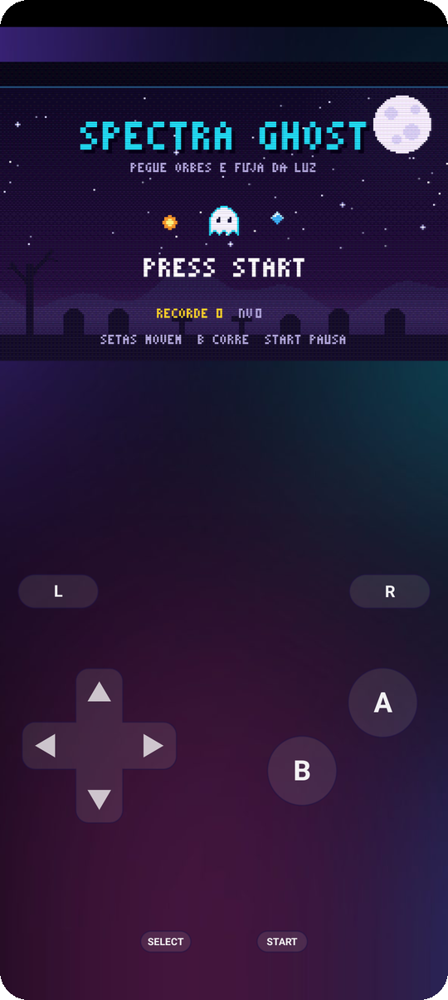
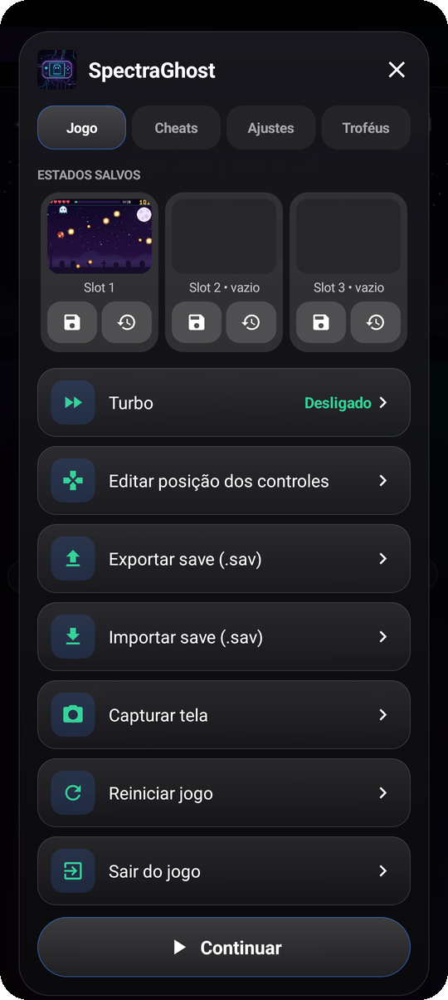
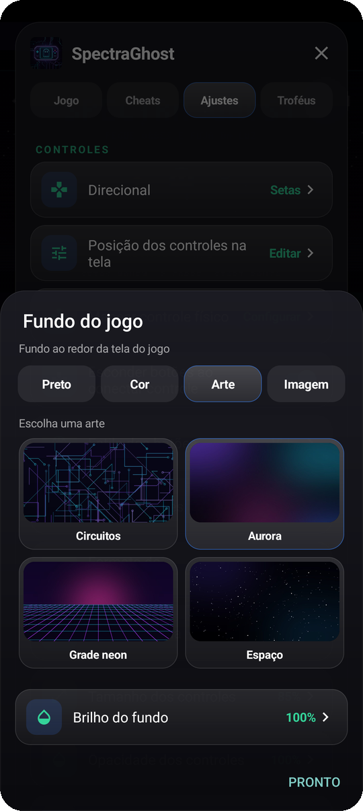
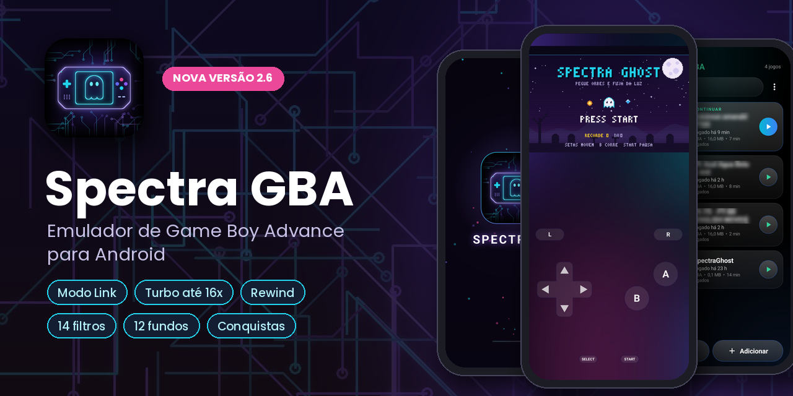

  

<h1 align="center">Spectra GBA</h1>

  Emulador de Game Boy Advance para Android, feito para jogar no celular com conforto.

  <a href="https://github.com/Bielk880/Spectra-GBA/releases/latest"><b>Baixar a última versão</b></a>
  &nbsp;·&nbsp;
  <a href="https://github.com/Bielk880/Spectra-GBA/issues">Relatar um problema</a>

  
  
  

---

## Capturas de tela

  
  
  
  

  

## Sobre o projeto

O Spectra GBA nasceu da vontade de ter um emulador simples de usar, com visual caprichado e as funções que realmente fazem falta no dia a dia. Por baixo, ele usa o mGBA, um dos núcleos de emulação mais precisos que existem.

## Funções

**Jogo**
- Modo Link: dois jogos rodando ao mesmo tempo no mesmo celular, ligados por um cabo virtual, para trocar e batalhar
- Save states com miniatura, salvamento automático e "retomar de onde parou"
- Rewind para voltar alguns segundos no tempo
- Velocidade de 0.2x (câmera lenta) até 16x
- Cheats nos formatos GameShark, Action Replay e CodeBreaker
- Conquistas do RetroAchievements

**Controles**
- Botões na tela totalmente ajustáveis: posição, tamanho, estilo e cor
- 7 estilos de botão, entre eles Vidro, Neon, Relevo 3D e Retrô
- Direcional em setas, cruz clássica ou joystick
- Barra de atalhos que pode ser movida, redimensionada ou escondida
- Suporte a controle Bluetooth, com mapeamento de botões

**Visual**
- 14 filtros de imagem, entre eles LCD, Scanlines, CRT, Suave e Conforto (menos luz azul)
- 12 fundos para a tela do jogo, além de cor sólida ou imagem da sua galeria
- Temas de cores e tela cheia ou ampliada no modo horizontal

**Saves e biblioteca**
- Saves .sav compatíveis com PKHeX, com opção de exportar e importar
- Backup dos saves no Google Drive
- Biblioteca com busca, capas e tempo de jogo
- Aviso automático quando sai uma versão nova
- Tela de início original do GBA, usando a sua própria BIOS (opcional)

## Requisitos

- Android 7.0 ou superior
- Processador de 64 bits (praticamente todos os celulares dos últimos anos)

## Instalação

1. Baixe o arquivo `.apk` na [página de lançamentos](https://github.com/Bielk880/Spectra-GBA/releases/latest)
2. Abra o arquivo e permita a instalação, se o Android pedir
3. No app, toque em **Sincronizar** para encontrar seus jogos ou em **Adicionar** para escolher um arquivo

Para atualizar, é só instalar a versão nova por cima. Seus jogos, saves e configurações continuam. A partir da versão 2.6, o próprio app avisa quando houver atualização.

## Perguntas frequentes

**O app vem com jogos?**
Não. O Spectra é só o emulador. Use cópias de jogos que você possui.

**Preciso da BIOS do GBA?**
Não. Ela é opcional e serve para exibir a tela de início original do console.

**Meus saves são compatíveis com outros emuladores?**
Sim. O formato .sav é o mesmo usado pela maioria dos emuladores e pelo PKHeX.

**Como funciona o Modo Link?**
No menu da biblioteca, escolha Modo Link e selecione dois jogos. Os dois rodam juntos, e você alterna entre eles tocando no nome do jogador. Para trocar ou batalhar, use a opção de conexão por cabo dentro de cada jogo. Faça backup dos saves antes de usar.

## Encontrou um problema?

Abra uma [Issue](https://github.com/Bielk880/Spectra-GBA/issues) contando o que aconteceu, o modelo do seu celular e o jogo. Sugestões também são bem-vindas.

## Créditos

- Emulação: [mGBA](https://mgba.io), de Jeffrey Pfau e colaboradores (Mozilla Public License 2.0)
- Conquistas: [rcheevos](https://github.com/RetroAchievements/rcheevos), do RetroAchievements (MIT License)

O Spectra foi desenvolvido com auxílio de IA na programação. A direção do projeto, os testes e os ajustes foram feitos por mim, com base nas sugestões da comunidade.

O jogo que aparece nas capturas é o Spectra Ghost, um jogo de demonstração feito para o projeto.

## Licença e privacidade

O Spectra GBA é distribuído gratuitamente, com todos os direitos reservados. Veja a [licença](LICENSE) e a [política de privacidade](PRIVACY.md).

## Aviso legal

O Spectra GBA não inclui jogos nem arquivos de BIOS e não apoia a pirataria.
Game Boy Advance é marca registrada da Nintendo. Este projeto não tem ligação nem aprovação da Nintendo.
